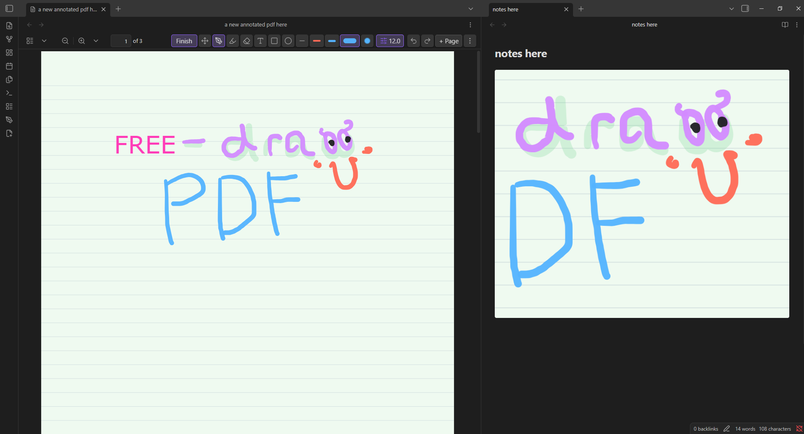

# Freedraw PDF

[](https://github.com/vividasasana/freedraw-pdf/releases/latest)

[](LICENSE)

Freedraw PDF is a freehand PDF annotation workspace for Obsidian. Draw directly over PDFs, add mixed-media annotations and template pages, embed annotated pages in notes, and export a finished PDF without modifying the source document.



The annotation workspace is shown on the left; the same annotated content is rendered as a live Markdown embed on the right.

## Highlights

- **Natural ink:** pressure-aware pen and highlighter tools powered by [perfect-freehand](https://github.com/steveruizok/perfect-freehand).
- **Complete annotation toolkit:** freehand ink, highlights, text boxes, rectangles, ellipses, lines, and images.
- **Non-destructive workflow:** annotations are stored in vault-backed sidecar files; the source PDF remains unchanged.
- **Flexible erasing:** object and segment eraser modes remove contacted annotations without recalculating surviving strokes.
- **Selection tools:** move, resize, duplicate, reorder, copy, cut, paste, and delete annotations.
- **Template pages:** insert blank, ruled, grid, or dotted pages between PDF pages.
- **Markdown integration:** embed a full annotated page or a selected region inside a note.
- **PDF export:** combine source pages, inserted pages, and annotations into one flattened PDF.

## Quick Start

1. Open a PDF in Obsidian.
2. Choose **Annotate** from the PDF toolbar, ribbon, or command palette.
3. Draw, highlight, add text or shapes, insert images, or add template pages.
4. Choose **Finish** to return to reading mode.
5. Use the overflow menu to copy an annotated embed, export the current page, or export the complete annotated PDF.

Freedraw PDF uses Obsidian's native PDF toolbar when available and falls back to a floating toolbar when necessary.

## Tools

| Tool | Purpose |
| --- | --- |
| Pen | Pressure-aware handwriting and freehand drawing with independent color and width presets. |
| Highlighter | Translucent emphasis with settings separate from the pen. |
| Eraser | Remove complete contacted objects or erase along a path. |
| Text | Add movable, resizable text boxes with independent color, font, size, bold, italic, and alignment controls. |
| Shapes | Add rectangles, ellipses, and straight lines. |
| Image | Place a vault-backed image on the current page. |
| Select | Move, resize, reorder, duplicate, copy, cut, paste, or delete annotations. |

## Annotated Markdown Embeds

Freedraw PDF can insert a live annotated page or selected region into a Markdown note. The generated block references the PDF, page, optional crop rectangle, and display width:

````markdown
```freedraw-pdf
path: Documents/example.pdf
page: 1
width: 720
```
````

The rendered embed follows the current sidecar annotation data. Optional embed controls can open the source page, refresh the rendering, or copy the block.

## Template Pages

Add temporary writing pages before, after, or at the end of the current PDF. Available options include:

- Blank, ruled, grid, and dotted templates.
- A4, letter, compact, and long page sizes.
- Configurable paper colors.
- Page duplication with or without annotations.
- Export alongside the original PDF pages.

Template pages remain editable during annotation and become regular flattened pages in an exported PDF.

Use **Pages** to search, open, rename, duplicate, restyle, clear, or remove pages. Removed PDF pages keep their annotations and removed template pages keep both their page settings and annotations. Restore them from the **Removed** filter, or permanently delete a removed template page when it is no longer needed.

## Installation

### GitHub Release

1. Download `main.js`, `manifest.json`, and `styles.css` from the [latest release](https://github.com/vividasasana/freedraw-pdf/releases/latest).
2. Create the following directory inside your vault:

   ```text
   .obsidian/plugins/freedraw-pdf
   ```

3. Place the three downloaded files in that directory.
4. Reload Obsidian.
5. Open **Settings → Community plugins** and enable **Freedraw PDF**.

### Community Plugins

1. Open **Settings → Community plugins → Browse**.
2. Search for **Freedraw PDF**.
3. Select **Install**, then **Enable**.

## Settings

The settings tab provides controls for:

- Native or floating toolbar placement.
- Pen, highlighter, and eraser defaults.
- Mouse, stylus, and touch input policy.
- Simulated or hardware stylus pressure.
- Ink thinning, streamline, smoothing, easing, and taper.
- Fast or high-quality live stroke previews.
- Autosave timing.
- Optional region, embed, notice, and rendering diagnostic controls.

Text formatting is preserved in live Markdown embeds, page snapshots, and exported PDFs. While editing text, use `Ctrl/Cmd+B` for bold and `Ctrl/Cmd+I` for italic.

## Storage and Export

Annotation data is stored in JSON sidecar files within the vault. Imported annotation images are also copied into the vault. Freedraw PDF does not overwrite the source PDF while editing.

Export creates a separate flattened PDF containing:

- Original PDF pages.
- Added template pages.
- Pen and highlighter strokes.
- Text, shapes, and images.

Use the exported file for sharing, printing, or archiving while retaining editable sidecar data in the vault.

## Compatibility

- Obsidian `1.12.0` or later.
- Windows, macOS, Linux, iOS, iPadOS, and Android, subject to Obsidian's native PDF viewer and device input support.
- Mouse, stylus, and configurable touch input.

The plugin integrates with Obsidian's native PDF viewer internals. A future Obsidian PDF viewer update may require a corresponding plugin update.

## Privacy

Freedraw PDF does not require an account, payment, analytics service, or network connection. PDFs, annotations, imported images, embeds, and exports remain in the vault unless you choose to share them.

## Troubleshooting

- **Toolbar missing:** set **Toolbar placement** to **Inside PDF toolbar** in the plugin settings.
- **Touch draws while scrolling:** set **Finger input** to **Pan with finger**.
- **Annotations missing:** confirm the PDF and its sidecar file remain in their original vault locations.
- **Export differs from the live view:** update to the latest release and retry with a copy of the source PDF.

Report reproducible problems through [GitHub Issues](https://github.com/vividasasana/freedraw-pdf/issues). Include the Obsidian version, plugin version, operating system, input device, and reproduction steps.

## Development

Requirements:

- Node.js 18 or later.
- npm.

```bash
git clone https://github.com/vividasasana/freedraw-pdf.git
cd freedraw-pdf
npm install
npm run check
npm run build
```

Useful commands:

| Command | Description |
| --- | --- |
| `npm run dev` | Build in watch mode. |
| `npm run build` | Create a production `main.js` bundle. |
| `npm run check` | Run the complete regression verifier suite. |
| `npm run deploy:test` | Build, verify, and deploy to the configured test vault. |
| `npm run package` | Build, verify, and package release assets. |

## Support and Security

- Use [GitHub Issues](https://github.com/vividasasana/freedraw-pdf/issues) for bug reports and feature requests.
- See [CONTRIBUTING.md](CONTRIBUTING.md) before submitting a code change.
- Follow [SECURITY.md](SECURITY.md) for security-sensitive reports.

## License

Freedraw PDF is available under the [MIT License](LICENSE).

Freehand stroke rendering uses [perfect-freehand](https://github.com/steveruizok/perfect-freehand), also licensed under MIT.
